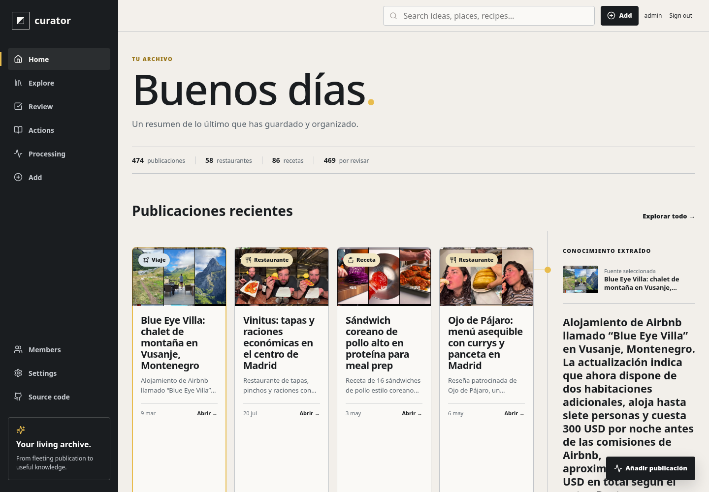
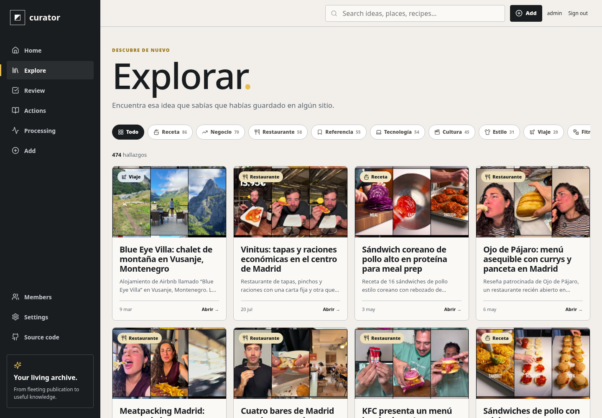
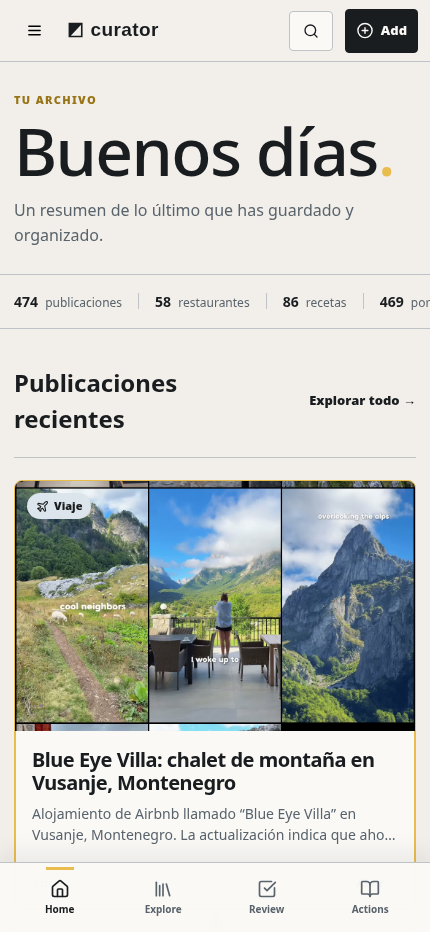

# Curator

Your saved Instagram feed, turned into a private and searchable personal
library.

Curator imports reels, posts, and carousels; downloads their media; transcribes
spoken audio with Whisper; and uses your own Codex subscription to classify and
organize everything. It is designed to run at home, stay accessible through
Tailscale, and keep its database and credentials under your control.

> **License:** open source under the
> [GNU Affero General Public License v3.0](./LICENSE). You may use, modify, and
> redistribute Curator, including commercially. If you modify it and make it
> available to users over a network, you must offer those users the
> corresponding source code under the same license.



## What it does

- Imports Instagram reels, posts, and multi-image carousels from a URL.
- Downloads media with `yt-dlp` and `gallery-dl`.
- Extracts audio and representative frames with FFmpeg.
- Transcribes audio through the OpenAI API using your own API key.
- Analyzes publications through Codex using your own ChatGPT subscription.
- Creates titles, summaries, categories, entities, and structured facets.
- Filters restaurants by cuisine and budget, recipes by style and nutrition
  goal, and fitness content by goal and muscle group.
- Provides a review queue, processing pipeline, retries, and analysis history.
- Supports an administrator and locally-created household accounts.
- Stores application state in SQLite and media on the local filesystem.
- Includes tested backup, restore, legacy migration, Docker, and systemd flows.

<table>
  <tr>
    <td width="68%"></td>
    <td width="32%"></td>
  </tr>
</table>

## How the pipeline works

```text
Instagram URL
    ↓
durable SQLite queue
    ↓
yt-dlp / gallery-dl
    ↓
FFmpeg audio + frames
    ↓
Whisper transcription
    ↓
Codex structured analysis
    ↓
searchable library + review queue
```

Failures are persisted in SQLite and can be retried from the interface. Existing
URLs are normalized and deduplicated before entering the queue.

## Quick start with Docker

You need Docker and Docker Compose. Clone the repository, then run:

```bash
cp .env.example .env
```

Set the public address from which you will open Curator:

```dotenv
CURATOR_BASE_URL=http://your-host:3000
CURATOR_TRUSTED_ORIGINS=http://your-host:3000
```

Start the application:

```bash
docker compose up -d --build
```

Alternatively, run the published multi-architecture image without cloning:

```bash
docker volume create curator-data
docker run -d \
  --name curator \
  --restart unless-stopped \
  -p 3000:3000 \
  -e CURATOR_BASE_URL=http://your-host:3000 \
  -e CURATOR_TRUSTED_ORIGINS=http://your-host:3000 \
  -v curator-data:/app/data \
  ghcr.io/cachaza/instagram-curator:latest
```

Versioned images are published as `ghcr.io/cachaza/instagram-curator:0.2.1`,
`0.2`, `0`, and `latest`.

Open `CURATOR_BASE_URL`. On a completely empty installation Curator creates its
database automatically, and the first registered account becomes the
administrator. Public registration closes immediately after that first
account.

The `curator-data` volume contains SQLite databases, downloaded media, uploaded
Instagram cookies, backups, API keys, and the isolated Codex login. Treat the
entire volume as private.

## Native installation

Requirements:

- Bun 1.3+
- Node.js 22+
- FFmpeg and `ffprobe`
- Python 3
- `yt-dlp`
- `gallery-dl`
- Codex CLI

Install dependencies and prepare the databases:

```bash
bun install
bun run db:migrate
bun run auth:migrate
```

For development:

```bash
bun run dev:tailscale
```

For a persistent production build on a Linux user account:

```bash
bun run build
bun run service:install
```

The included user-level systemd unit launches Next.js and the worker, restarts
them after failures, and applies a restrictive umask. Review
[`deploy/instagram-curator.service`](deploy/instagram-curator.service) if your
host address or binary paths differ.

## Initial setup

The administrator is guided through the setup screens:

1. Choose Spanish or English and add an OpenAI API key for Whisper.
2. Configure Instagram with an uploaded Netscape-format cookies file or a
   Firefox profile.
3. Authorize Codex through the device-code flow. The Codex state is isolated
   under Curator's `data` directory.
4. Run diagnostics to verify SQLite, storage, FFmpeg, downloaders, Instagram,
   OpenAI, and Codex.

No Instagram password is required. A cookies file is usually more reliable for
self-hosting and can be replaced from the settings interface.

## Import API

The browser interface is available at `/import`. External tools, shortcuts, or
future share-sheet integrations can use the bearer token generated during
setup:

```bash
curl -X POST http://your-host:3000/api/v1/imports \
  -H 'content-type: application/json' \
  --oauth2-bearer "$CURATOR_SHARE_TOKEN" \
  -d '{"url":"https://www.instagram.com/reel/SHORTCODE/"}'
```

A valid request returns `202 Accepted` with the durable publication identifier.
Submitting the same publication again returns its existing record.

## Backup and restore

Create a consistent backup:

```bash
bun run backup
```

Stop the service before restoring:

```bash
bun run restore -- /path/to/backup --confirm
```

Restore validates SQLite integrity and preserves the previous database and media
directory with a timestamped recovery suffix. Backups contain private media and
credentials; store them accordingly.

## Migrating from the original prototype

```bash
bun run migrate:legacy -- \
  --database ../instagram-curator/data/curator.sqlite \
  --media ../instagram-curator/data/reels
```

The migration leaves the legacy database untouched, copies transcripts and
analyses into the new model, and uses hard links for media when both projects
are on the same filesystem.

## Data and security

- SQLite is the source of truth.
- Secrets are stored locally in SQLite or private runtime files.
- `data/`, cookies, databases, backups, and downloaded media are ignored by Git.
- Codex runs with read-only filesystem access and approvals disabled for
  automated analysis.
- Curator is intended to sit behind Tailscale or another trusted private
  network. Do not expose it directly to the public Internet without adding TLS,
  hardened proxying, and an appropriate security review.
- Imported Instagram media remains subject to Instagram's terms and the rights
  of its original creators.

## Project structure

```text
src/app/             Next.js pages and HTTP endpoints
src/components/      shared interface components
src/lib/             database, auth, setup, content, and Codex integration
src/worker/          download, media, transcription, and analysis pipeline
scripts/             migrations, backups, restore, and service installation
deploy/              systemd unit
docs/                architecture notes and screenshots
data/                private runtime state; never committed
```

The full product direction lives in
[`OPEN_SOURCE_PLAN.md`](OPEN_SOURCE_PLAN.md), with longer-term RAG and pgvector
ideas in [`docs/FUTURE_ARCHITECTURE.md`](docs/FUTURE_ARCHITECTURE.md).

## Development checks

```bash
bun run typecheck
bun run lint
bun test
bun run build
```

Contributions are welcome. By contributing, you agree that your contribution
may be distributed under the GNU Affero General Public License v3.0.
See [`CONTRIBUTING.md`](CONTRIBUTING.md) for the development workflow, checks,
privacy rules, and pull-request expectations.

Copyright © 2026 David Cachaza.

---

Built for people who save far more than Instagram makes easy to find again.
